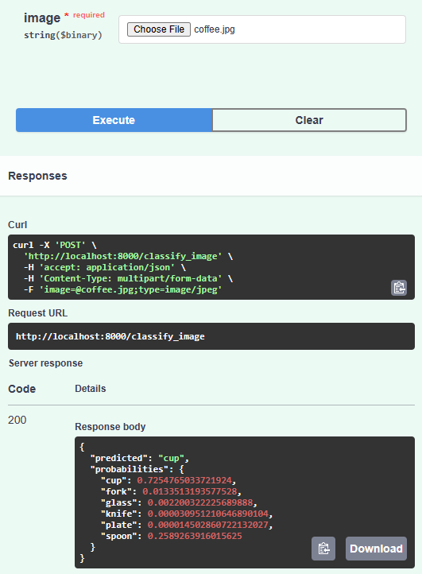
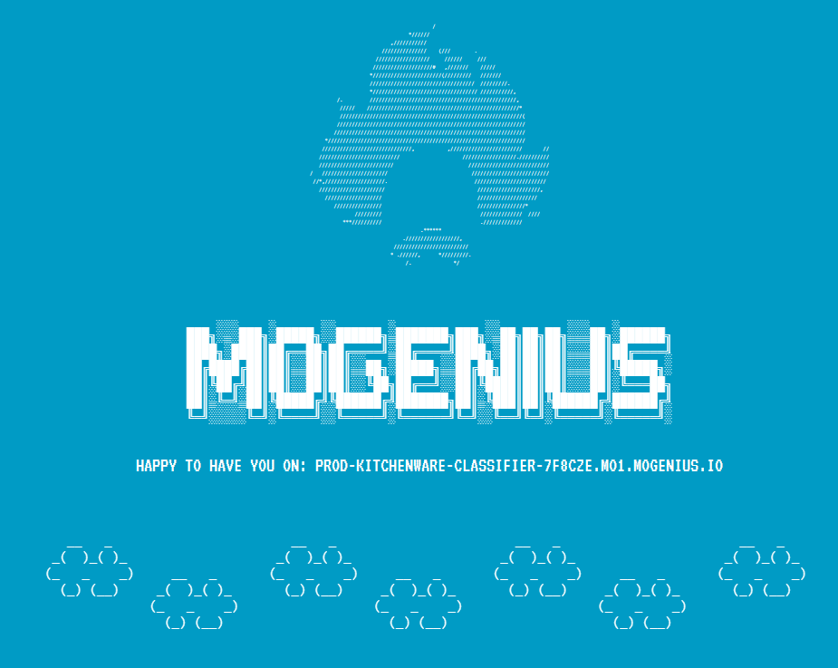

# Kitchenware Classification (*kitchenware_classifier*)

> *Classifies kitchen stuff items into 6 categories: cups, glasses, plates, spoons, forks and knives*

![Python version][python-version]
![Latest version][latest-version]
[![GitHub issues][issues-image]][issues-url]
[![GitHub forks][fork-image]][fork-url]
[![GitHub Stars][stars-image]][stars-url]
[![License][license-image]][license-url]

NOTE: This project was generated with [Cookiecutter](https://github.com/audreyr/cookiecutter) along with [@clamytoe's](https://github.com/clamytoe) [toepack](https://github.com/clamytoe/toepack) project template.

This repo is the result of my capstone project for the Machine Learning Zoomcamp 2022 course. I used the model for a [Kitchenware Classification](https://www.kaggle.com/competitions/kitchenware-classification) competition that was hosted by the [DataTalks.Club](https://datatalks.club/) over at [Kaggle](https://www.kaggle.com).

The model will take an image of a kitchenware item and try to classify it into one of the following classes:

* cups
* forks
* glasses
* knives
* plates
* spoons

I was able to score a `0.97674` with it and am currently in the 13th place as a member of Team **Penumbra**!

My fellow team mebers were:

* Roman Zabolotin - Junior Data Scientist
* Tatiana Ankudo - Analyst

## The data

The dataset is pretty big so I did not include it here. You can download it from the competition page.

In order to get things to work right the first time, extract it's contents into the `kitchenware_classifier/data/` folder.

> **NOTE:** I've added the [extra images](https://www.kaggle.com/datasets/agrigorev/kitchenware-extra-images) that were given to the community by Walukagga Patrick.

My tree structure looks like this:

```zsh
├── Dockerfile
├── LICENSE
├── Pipfile
├── Pipfile.lock
├── README.md
├── api.py
├── environment.yml
├── fastai_model.pkl
├── favicon.ico
├── images
│   ├── coffe.jpg
│   ├── deployment.png
│   ├── docs.png
│   ├── mogenius-welcome.png
│   ├── mogenius.png
│   ├── post.png
│   ├── result.png
│   ├── selected.png
│   ├── settings.png
│   └── upload.png
├── kitchenware_classifier
│   ├── data
│   │   ├── extra.csv
│   │   ├── images
│   │   ├── models
│   │   ├── sample_submission.csv
│   │   ├── test.csv
│   │   └── train.csv
│   ├── extra-images.zip
│   └── kitchenware-classification.zip
├── kw_router.py
├── notebook.ipynb
├── predict.py
├── requirements.txt
├── sample.jpg
├── sample2.jpg
├── send_multiple_images.py
├── send_single_image.py
├── submission.csv
├── test_model.py
└── train.py
```

## Initial setup

First thing to do is to create or change directories into wherever you keep all of your projects.
For me, it's the `Projects` folder.
Once there clone this repo.

```zsh
(py310) ➜ cd Projects
(py310) ➜ git clone <https://github.com/clamytoe/kitchenware_classifier.git>
(py310) ➜ cd kitchenware_classifier
```

## Anaconda setup

If you are an Anaconda user, this command will get you up to speed with the base installation.

```zsh
(py310) ➜ conda env create
(py310) ➜ conda activate kwc
```

## Regular Python setup

If you are just using normal Python, this will get you ready.
First thing is to create a virtual environment. There are many ways to do this, but the simplest is using `venv`.

```zsh
(py310) ➜ python3 -m venv venv
(py310) ➜ source venv/bin/activate
(venv) ➜ pip install -r requirements.txt
```

## Generating the model

> **NOTE:** I've included the model, `fastai_model.pkl`, but due to it's size, GitHub complained about it. If I have to remove it, you will have to build your own, or use the provided Docker [image](https://hub.docker.com/r/clamytoe/kitchenware-clf), which has it.

Once you have your local virtual environment setup,
you just need to run the `train.py` script and some coffee to generate it.

```zsh
(kwc) ➜ python train.py
Finding best learning rate...
lrs=SuggestedLRs(minimum=0.004786301031708717, steep=1.4454397387453355e-05, valley=0.0005754399462603033, slide=0.0014454397605732083)
Training the Model...
epoch     train_loss  valid_loss  error_rate  accuracy  time
0         0.319466    0.125656    0.040504    0.959496  01:28
Better model found at epoch 0 with valid_loss value: 0.12565582990646362.
1         0.247616    0.090624    0.034203    0.965797  01:29
Better model found at epoch 1 with valid_loss value: 0.09062422811985016.
2         0.201797    0.092758    0.030603    0.969397  01:29
3         0.163881    0.100454    0.034203    0.965797  01:29
4         0.152107    0.092587    0.033303    0.966697  01:29
No improvement since epoch 1: early stopping
Model validation: [0.09062422811985016, 0.0342034213244915, 0.9657965898513794]
Saving model as: fastai_model.pkl...
Training completed!
```

## Start the server

Once your environment is setup, this one command will start the server:

```zsh
(kwc) ➜ uvicorn api:app --reload
```

## Usage

With the server up and running, you can now send it images to classify for you. I have included two sample images:


and


I have provided two sample scripts:

* `send_simgle_image.py`
* `send_multiple_images.py`

With the server running, you can run either of the scripts to test out the server.

*send_simgle_image.py:*

```zsh
(kwc) ➜ python send_single_image.py
{'predicted': 'fork', 'probabilities': {'cup': 2.682557351363357e-05, 'fork': 0.9998975992202759, 'glass': 2.706188070078497e-06, 'knife': 5.796951882075518e-06, 'plate': 6.11106152064167e-05, 'spoon': 5.840373432874912e-06}}
```

*send_multiple_images.py:*

```zsh
(kwc) ➜ python python send_multiple_images.py
{'image': 'sample2.jpg', 'predicted': 'plate', 'probabilities': {'cup': 0.00012867810437455773, 'fork': 5.518031230167253e-06, 'glass': 1.5953222828102298e-05, 'knife': 1.3917076557845576e-07, 'plate': 0.9998399019241333, 'spoon': 9.731486898090225e-06}}
{'image': 'sample.jpg', 'predicted': 'fork', 'probabilities': {'cup': 2.682557351363357e-05, 'fork': 0.9998975992202759, 'glass': 2.706188070078497e-06, 'knife': 5.796951882075518e-06, 'plate': 6.11106152064167e-05, 'spoon': 5.840373432874912e-06}}
```

> **NOTE:** By default the scripts submit the images to my cloud service. To test locally, just change the url setting from `url["cloud"]` to `url["local"]`.

## A much easier way

The benefit of using [FasAPI](https://fastapi.tiangolo.com/) is that it makes things much easier and faster.
For instance, if you nagivate to: [http://localhost:8000/docs](http://localhost:8000/docs) you will be able to interact with the application.


### GET / Welcome

This entrypoint just returns some information about me and the project.

### POST /classify_image Classify Image

This is where you get to play with the model and see how well/bad it works.
Feed it an image of a kitchenware item and see how it does.

To use it, simply click on the **POST** button to expand it:


Then click on the **Try it out** button.


This will reveal a **Choose File** button that will allow you to navigate your filesystem and choose and image.

Here, I've randomly chosen a tricky one from the [Internet](https://static.turbosquid.com/Preview/2014/07/07__23_41_37/coffe_cup_preview_02.jpgc89daf5f-e0b8-46f7-929d-8c618f1b09fcLarge.jpg) to see what the model picks up:


With the image loaded:


Simply click on the big **Execute** button to process the image.

If you scroll down a bit, you will see your results:



As you can see, it picked up on the cup!

## Docker image

If you would rather not have to download this repo, create an environmet, download the dataset, etc, you can run this as a docker container.
Simply download an already compiled version from [Docker Hub](https://hub.docker.com): [Kitchenware Classifier](https://hub.docker.com/r/clamytoe/kitchenware-clf)

```zsh
(kwc) ➜ docker pull clamytoe/kitchenware-clf
```

Once you have the image you can run it as so:

```zsh
(kwc) ➜ docker run -it --rm -p 8000:8000 clamytoe/kitchenware-clf
```

> **NOTE:** The image is 3.77GB but expands to 6.06GB.

## Build your own

If you would rather build the docker image yourself, I have included the `Dockerfile` just for that purpose.
Just run the following command from the directory where you cloned this repo to:

```zsh
(kwc) ➜ docker build -t kitchenware-clf .
```

Once you have the image you can run it as so:

```zsh
(kwc) ➜ docker run -it --rm -p 8000:8000 kitchenware-clf
```

## Cloud deployment

I've been really impressed with the ease of use of [Mogenius](https://mogenius.com/) so I went ahead and deployed the model there.



Give it a try: [Kitchenware Classifier on Mogenius](https://kitchenware-cl-prod-kitchenware-classifier-7f8cze.mo1.mogenius.io/docs)

Here is what the dashboard looks like after classifying an image.


> The free tier is a bit slow, but for free and extreme ease of use, it's perfect!

### Prepare model for cloud deployment

Before I could even think about getting my model on the cloud, I first had to tag my image and push it to docker hub.

```zsh
(kwc) ➜ docker tag kitchenware-clf clamytoe/kitchenware-clf:latest
```

> **NOTE:** Make sure to use your own docker hub user name.

Once the image has been properly named, it can now be push.

```zsh
(kwc) ➜ docker push clamytoe/kitchenware-clf:latest
```

> Mogenius allows you to deploy from an existing image but it can also just build it from yoru GitHub repo, as long as you have a `Dockerfile`.

Once the image has been uploaded to Docker Hub, it was relatively easy to set it up.


> **NOTE:** Just remember to expose the correct port.

*Deployment from docker hub image in progress...*


More detailed instructions can be found in their [Quickstart Guide](https://docs.mogenius.com/getting-started/quickstart).

## License

Distributed under the terms of the [MIT](https://opensource.org/licenses/MIT) license, "kitchenware_classifier" is free and open source software.

## Issues

If you encounter any problems, please [file an issue](https://github.com/clamytoe/toepack/issues) along with a detailed description.

[python-version]:https://img.shields.io/badge/python-3.10.6-brightgreen.svg
[latest-version]:https://img.shields.io/badge/version-1.0.0-blue.svg
[issues-image]:https://img.shields.io/github/issues/clamytoe/kitchenware_classifier.svg
[issues-url]:https://github.com/clamytoe/kitchenware_classifier/issues
[fork-image]:https://img.shields.io/github/forks/clamytoe/kitchenware_classifier.svg
[fork-url]:https://github.com/clamytoe/kitchenware_classifier/network
[stars-image]:https://img.shields.io/github/stars/clamytoe/kitchenware_classifier.svg
[stars-url]:https://github.com/clamytoe/kitchenware_classifier/stargazers
[license-image]:https://img.shields.io/github/license/clamytoe/kitchenware_classifier.svg
[license-url]:https://github.com/clamytoe/kitchenware_classifier/blob/master/LICENSE
