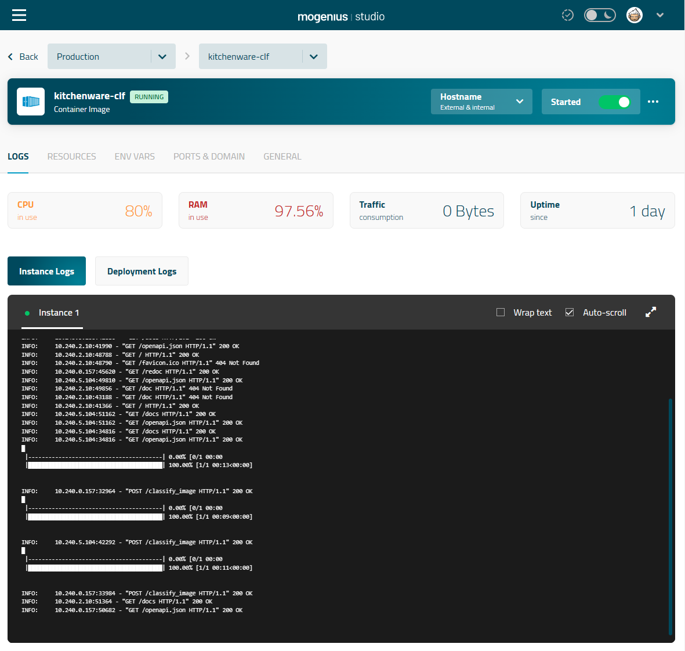

# Kitchenware Classification (*kitchenware_classifier*)

> *Classifies kitchen stuff items into 6 categories: cups, glasses, plates, spoons, forks and knives*

![Python version][python-version]
![Latest version][latest-version]
[![GitHub issues][issues-image]][issues-url]
[![GitHub forks][fork-image]][fork-url]
[![GitHub Stars][stars-image]][stars-url]
[![License][license-image]][license-url]

NOTE: This project was generated with [Cookiecutter](https://github.com/audreyr/cookiecutter) along with [@clamytoe's](https://github.com/clamytoe) [toepack](https://github.com/clamytoe/toepack) project template.

This repo is the result of my capstone project for the Machine Learning Zoomcamp 2022 course. I used the model for a [Kitchenware Classification](https://www.kaggle.com/competitions/kitchenware-classification) competition that was hosted by the [DataTalks.Club](https://datatalks.club/) over at [Kaggle](https://www.kaggle.com).

The model will take an image of a kitchenware item and try to classify it into one of the following classes:

* cups
* forks
* glasses
* knives
* plates
* spoons

I was able to score a `0.97674` with it and am currently in the 13th place as a member of Team **Penumbra**!

My fellow team mebers were:

* Roman Zabolotin - Junior Data Scientist
* Tatiana Ankudo - Analyst

## The data

The dataset is pretty big so I did not include it here. You can download it from the competition page.

In order to get things to work right the first time, extract it's contents into the `kitchenware_classifier/data/` folder.

My tree structure looks like this:

```zsh
├── Dockerfile
├── LICENSE
├── Pipfile
├── Pipfile.lock
├── README.md
├── api.py
├── environment.yml
├── evaluate_model.py
├── fastai-classifier.ipynb
├── fastai_model.pkl
├── favicon.ico
├── images
│   ├── coffe.jpg
│   ├── docs.png
│   ├── post.png
│   ├── result.png
│   ├── selected.png
│   └── upload.png
├── kitchenware_classifier
│   ├── data
│   │   ├── images
│   │   ├── sample_submission.csv
│   │   ├── test.csv
│   │   └── train.csv
│   └── kitchenware-classification.zip
├── kw_router.py
├── predictions
│   └── fastai-submission.csv
├── requirements.txt
├── sample.jpg
├── sample2.jpg
├── test_model.py
├── test_multiple_images.py
├── test_single_image.py
└── train.py
```

> **NOTE:** I've included the model, `fastai_model.pkl`, but due to it's size, GitHub complained about it. If I have to remove it, you will have to build your own, or use the provided Docker [image](https://hub.docker.com/r/clamytoe/kitchenware-clf), which has it.

## Initial setup

First thing to do is to create or change directories into wherever you keep all of your projects.
For me, it's the `Projects` folder.
Once there clone this repo.

```zsh
(py310) ➜ cd Projects
(py310) ➜ git clone <https://github.com/clamytoe/kitchenware_classifier.git>
(py310) ➜ cd kitchenware_classifier
```

## Anaconda setup

If you are an Anaconda user, this command will get you up to speed with the base installation.

```zsh
(py310) ➜ conda env create
(py310) ➜ conda activate kwc
```

## Regular Python setup

If you are just using normal Python, this will get you ready.
First thing is to create a virtual environment. There are many ways to do this, but the simplest is using `venv`.

```zsh
(py310) ➜ python3 -m venv venv
(py310) ➜ source venv/bin/activate
(venv) ➜ pip install -r requirements.txt
```

## Start the server

Once your environment is setup, this one command will start the server:

```zsh
(kwc) ➜ uvicorn api:app --reload
```

## Usage

With the server up and running, you can now send it images to classify for you. I have included two sample images:


and


I have provided two sample scripts:

* `test_simgle_image.py`
* `test_multiple_images.py`

With the server running, you can run either of the scripts to test out the server.

*test_simgle_image.py:*

```zsh
(kwc) ➜ python test_single_image.py
{'class': 'fork'}
```

*test_multiple_images.py:*

```zsh
(kwc) ➜ python test_multiple_images.py
[{'image': 'sample2.jpg', 'class': 'plate'}, {'image': 'sample.jpg', 'class': 'fork'}]
```

Now you can modify the scripts and use them for your own purpose.

## A much easier way

The benefit of using [FasAPI](https://fastapi.tiangolo.com/) is that it makes things much easier and faster.
For instance, if you nagivate to: [http://localhost:8000/docs](http://localhost:8000/docs) you will be able to interact with the application.


### GET / Welcome

This entrypoint just returns some information about me and the project.

### POST /classify_image Classify Image

This is where you get to play with the model and see how well it works.
Feed it an image of kitchenware item and see how well it does.

To use it, simply click on the **POST** button to expand it:


Then click on the **Try it out** button.


This will reveal a **Choose File** button that will allow you to navigate your filesystem and choose and image.

Here, I've randomly chosen a tricky one from the [Internet](https://static.turbosquid.com/Preview/2014/07/07__23_41_37/coffe_cup_preview_02.jpgc89daf5f-e0b8-46f7-929d-8c618f1b09fcLarge.jpg) to see what the model picks up:


With the image loaded:


Simply click on the big **Execute** button to process the image.

If you scroll down a bit, you will see your results:


As you can see, it picked up on the cup!

## Docker image

If you would rather not have to download this repo, create an environmet, download the dataset, etc, you can run this as a docker container.
Simply download an already compiled version from [Docker Hub](https://hub.docker.com): [Kitchenware Classifier](https://hub.docker.com/r/clamytoe/kitchenware-clf)

```zsh
(kwc) ➜ docker pull clamytoe/kitchenware-clf
```

Once you have the image you can run it as so:

```zsh
(kwc) ➜ docker run -it --rm -p 8000:8000 clamytoe/kitchenware-clf
```

> **NOTE:** The image is just a little over 6GB.

### Build your own

If you would rather build the docker image yourself, I have included the `Dockerfile` just for that purpose.
Just run the following command from the directory where you cloned this repo to:

```zsh
(kwc) ➜ docker build -t kitchenware-clf .
```

Once you have the image you can run it as so:

```zsh
(kwc) ➜ docker run -it --rm -p 8000:8000 kitchenware-clf
```

## Cloud deployment

I've been really impressed with the ease of use of [Mogenius.io](https://mogenius.com/) so I went ahead and deployed the model there.

[Kitchenware Classifier on Mogenius.io](kitchenware-cl-prod-kitchenware-classifier-7f8cze.mo1.mogenius.io:80/docs)

Here is what the dashboard looks like after classifying an image.



> The free tier is a bit slow, but for free and extreme ease of use, it's perfect!

### Prepare model for cloud deployment

Before I could even think about getting my model on the cloud, I first have to tag my image and push it to docker hub.

```zsh
(kwc) ➜ docker tag kitchenware-clf clamytor/kitchenware-clf:latest
```

> **NOTE:** Make sure to use your own docker hub user name.

Once your image has been properly named, you can now push it.

```zsh
(kwc) ➜ docker push clamytoe/kitchenware-clf:latest
```

Mogenius allows you to deploy from an existing image but it can also just build it from yoru GitHub repo, as long as you have a `Dockerfile`.
Detailing the steps here is beyond the scope of this project, but it's really simple. Simply head over to Mogenius and check out their [Quickstart Guide](https://docs.mogenius.com/getting-started/quickstart).

*Deplyment from docker hub image in progress...*


## Contributing

Contributions are welcomed.
Tests can be run with with `pytest -v`, please ensure that all tests are passing and that you've checked your code with the following packages before submitting a pull request:

* black
* flake8
* isort
* mypy
* pytest-cov

I am not adhering to them strictly, but try to clean up what's reasonable.

## License

Distributed under the terms of the [MIT](https://opensource.org/licenses/MIT) license, "kitchenware_classifier" is free and open source software.

## Issues

If you encounter any problems, please [file an issue](https://github.com/clamytoe/toepack/issues) along with a detailed description.

## Changelog

* **v0.1.0** Initial commit.

[python-version]:https://img.shields.io/badge/python-3.10.6-brightgreen.svg
[latest-version]:https://img.shields.io/badge/version-1.0.0-blue.svg
[issues-image]:https://img.shields.io/github/issues/clamytoe/kitchenware_classifier.svg
[issues-url]:https://github.com/clamytoe/kitchenware_classifier/issues
[fork-image]:https://img.shields.io/github/forks/clamytoe/kitchenware_classifier.svg
[fork-url]:https://github.com/clamytoe/kitchenware_classifier/network
[stars-image]:https://img.shields.io/github/stars/clamytoe/kitchenware_classifier.svg
[stars-url]:https://github.com/clamytoe/kitchenware_classifier/stargazers
[license-image]:https://img.shields.io/github/license/clamytoe/kitchenware_classifier.svg
[license-url]:https://github.com/clamytoe/kitchenware_classifier/blob/master/LICENSE
